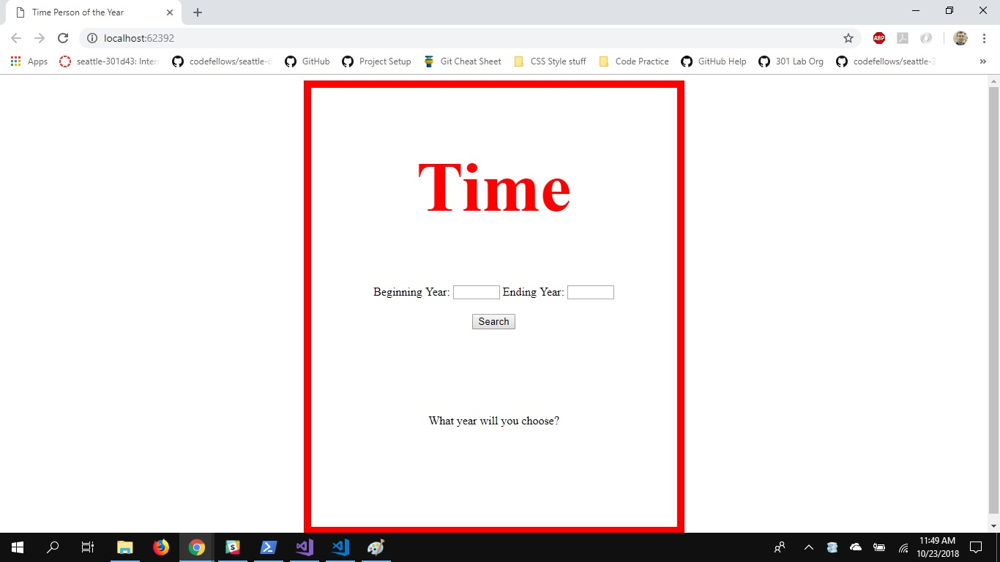
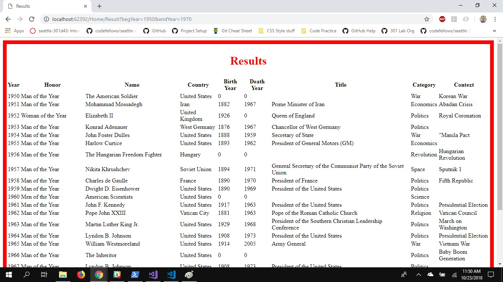

# TIME Person of the Year Finder
## Description
This web app lets a user search for Time People of Year. The user provides a beginning year and an end year. The user will then be redirected to a results page.

## Instructions
1. Start Visual Studio
2. Open the Solution File
3. Select Run IIS Express
4. Follow onscreen prompts

## Visual

